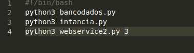

# APS Cloud
#### Bruna Mayumi Kimura
______________________________

## Introdução

Esse projeto consiste em criar uma arquitetura de solução.

## Instalação

Clone este git em uma máquina e rode o script "executavel.sh", ele será responsável por criar todas as dependências necessárias para subir o restante das máquinas.

## Determinando a quantidade de máquinas no load balance

Para determinar quantas máquinas estará rodando na nuvem basta alterar o arquivo "executavel.sh" na última linha o número que segue o arquivo "webservice2.py". A Figura 1, mostra um exemplo de como executar 3 máquinas.

Figura 1: executavel com 3 máquinas

